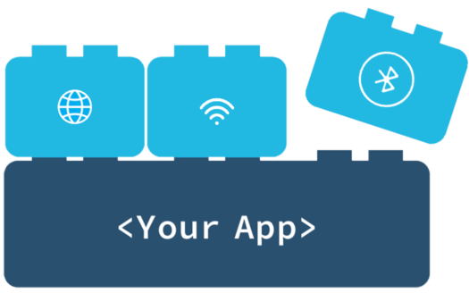

Reducing the friction for IOT application developers by providing drop-in chunks of functionality.

## Highlights
* **Pre-built containers**: Just drop them into your IOT projects
* **Provide functionality**: Need a containerised browser? Just drop in the [browser block](https://github.com/balenablocks/browser)!
* **Intelligent and opinionated**: Blocks discover each other and work together automatically.

## Motivation
Blocks are a concept that came out of the [labs](https://github.com/balenalabs) at balena.

Balena's mission is to reduce friction for fleet owners and unlock the power of physical computing. Blocks contribute to this by removing some friction for developers of IOT applications by providing pre-built chunks of functionality. The enable application developers to focus only on the code they need to write, and rely on the blocks to provide everything else.

